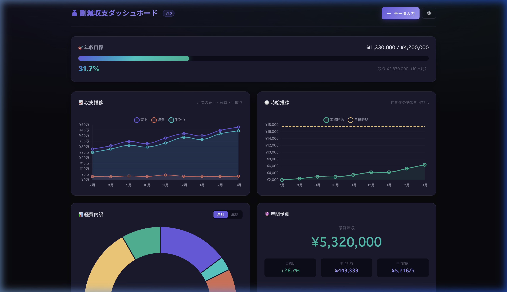

# 副業収支ダッシュボード

> フリーランス・副業の収支管理に特化した、ブラウザ完結型ダッシュボード



## ✨ 特徴

| 機能 | 説明 |
|------|------|
| 📈 **収支推移グラフ** | 月次の売上・経費・手取りを折れ線グラフで可視化 |
| 🕐 **時給推移** | 稼働時間から時給を自動計算し、目標時給との差を表示 |
| 📊 **経費カテゴリ内訳** | 通信費・交通費・家賃按分などをドーナツチャートで表示 |
| 🔮 **年間予測** | 直近3ヶ月のトレンドから年間収入を予測 |
| 💰 **節税シミュレーター** | 青色申告・小規模企業共済・ふるさと納税の効果をリアルタイム計算 |
| 🎯 **目標プログレス** | 年間売上目標に対する達成率をグロー付きプログレスバーで表示 |
| 📥 **CSV入出力** | データのエクスポート/インポートで外部連携可能 |

## 🛡️ プライバシー

**データは全てブラウザの `localStorage` に保存されます。** サーバーへの送信は一切行いません。

- ✅ インターネット不要（オフライン対応）
- ✅ アカウント登録不要
- ✅ 個人の収支データが外部に漏れない

## 🚀 デモ

**[→ デモを見る](https://YOUR_USERNAME.github.io/fukugyo-dashboard/)**

設定（⚙️）→「デモデータで試す」ボタンで、サンプルデータが読み込まれます。

## 🛠️ 技術スタック

- **Vite** — 高速なビルドツール
- **Chart.js** — グラフ描画
- **Vanilla JS** — フレームワーク不使用で軽量
- **CSS カスタムプロパティ** — ダークモードのデザインシステム

## 📦 セットアップ

```bash
# リポジトリをクローン
git clone https://github.com/YOUR_USERNAME/fukugyo-dashboard.git
cd fukugyo-dashboard

# 依存関係をインストール
npm install

# 開発サーバーを起動
npm run dev
```

ブラウザで `http://localhost:5173` を開きます。

## 📤 デプロイ（GitHub Pages）

```bash
# プロダクションビルド
npm run build

# dist フォルダの中身を gh-pages ブランチにプッシュ
npx gh-pages -d dist
```

または、GitHub Actions で自動デプロイも可能です。

## 🧮 税金計算について

節税シミュレーターは以下の税制に基づいています：

- **所得税**: 令和7年の速算表（累進課税7段階）
- **住民税**: 一律10% + 均等割5,000円
- **国民年金**: 月額17,510円（令和7年度）
- **国保**: 所得割9.6% + 均等割5万円（概算）
- **青色申告特別控除**: 65万円
- **ふるさと納税上限**: 住民税所得割額の20%

> ⚠️ 実際の税額は自治体や個人の状況により異なります。正確な計算は税理士にご相談ください。

## 📂 プロジェクト構成

```
fukugyo-dashboard/
├── index.html          # メインHTML
├── src/
│   ├── main.js         # エントリーポイント（UI統合）
│   ├── data.js         # データ管理（localStorage CRUD）
│   ├── tax.js          # 税金計算エンジン
│   ├── charts.js       # グラフ描画（Chart.js）
│   └── style.css       # デザインシステム（ダークモード）
├── vite.config.js      # Vite設定
└── package.json
```

## 📝 ライセンス

MIT
